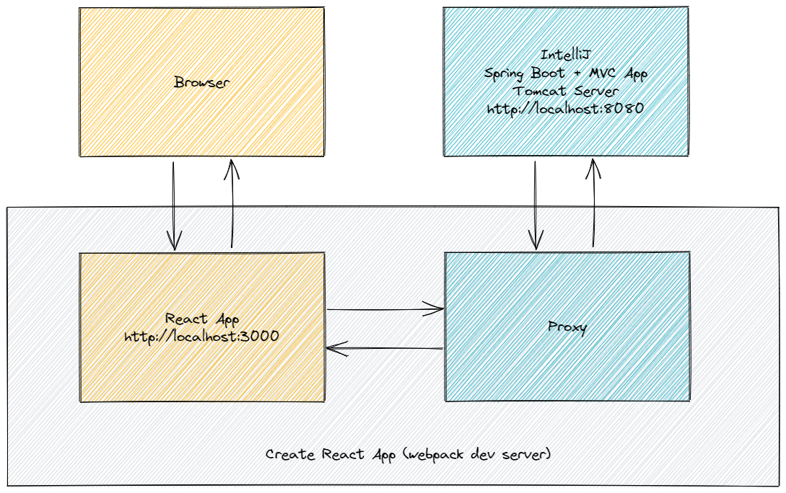
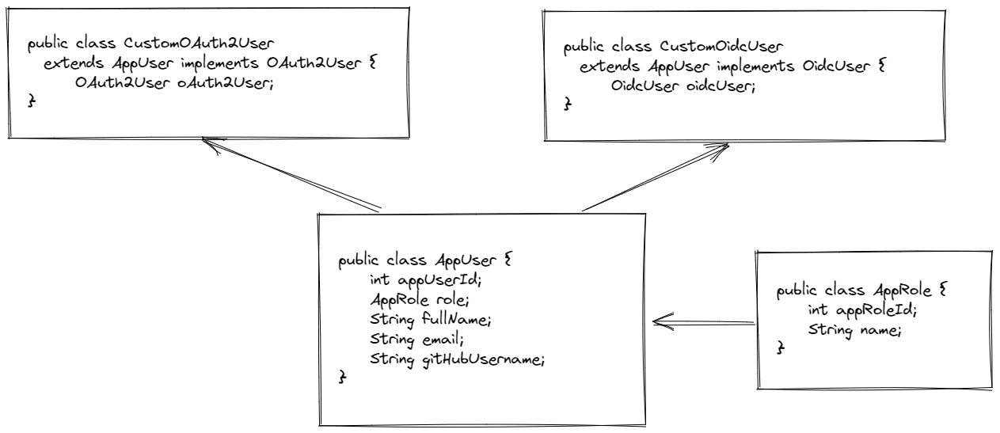

# Exercise: Implement User Authentication Using OpenID Connect (OIDC)

## Goals

Implement authentication using OpenID Connect (OIDC) within a new Spring Boot application.

## Details

By leveraging an identity provider, it's possible to get out of the business of storing user passwords and/or identity information. In this exercise, you'll use Spring Security's support OpenID Connect (OIDC) to allow users to authentication with external identity providers such as GitHub and Google.

## Steps

1. [Create a New Project](#1-create-a-new-project)
2. [Securing the Application with GitHub and Spring Security](#2-securing-the-application-with-github-and-spring-security)
3. [Add a Welcome Page](#3-add-a-welcome-page)
4. [Login with Google](#4-login-with-google)
5. [Logout](#5-logout)
6. [Adding Support for React](#6-adding-support-for-react)
7. [Building the JAR for Deployment](#7-building-the-jar-for-deployment)
8. [Supporting Client Side Routing](#8-supporting-client-side-routing)
9. [Customizing the OIDC User](#9-customizing-the-oidc-user)
10. [Associating Data with Users](#10-associating-data-with-users)

### 1. Create a New Project

Create a new Maven project with the following project values:

* `groupId`: learn
* `artifactId`: openid-connect-example

**pom.xml**

```xml
<?xml version="1.0" encoding="UTF-8"?>
<project xmlns="http://maven.apache.org/POM/4.0.0"
         xmlns:xsi="http://www.w3.org/2001/XMLSchema-instance"
         xsi:schemaLocation="http://maven.apache.org/POM/4.0.0 http://maven.apache.org/xsd/maven-4.0.0.xsd">
    <modelVersion>4.0.0</modelVersion>

    <groupId>learn</groupId>
    <artifactId>openid-connect-example</artifactId>
    <version>1.0-SNAPSHOT</version>

    <properties>
        <maven.compiler.source>17</maven.compiler.source>
        <maven.compiler.target>17</maven.compiler.target>
    </properties>

    <parent>
        <groupId>org.springframework.boot</groupId>
        <artifactId>spring-boot-starter-parent</artifactId>
        <version>2.7.8</version>
        <relativePath/>
    </parent>

    <dependencies>
        <dependency>
            <groupId>org.springframework.boot</groupId>
            <artifactId>spring-boot-starter-web</artifactId>
        </dependency>
        <dependency>
            <groupId>org.springframework.boot</groupId>
            <artifactId>spring-boot-devtools</artifactId>
            <scope>runtime</scope>
        </dependency>
        <dependency>
            <groupId>org.springframework.boot</groupId>
            <artifactId>spring-boot-starter-test</artifactId>
            <scope>test</scope>
            <exclusions>
                <exclusion>
                    <groupId>org.junit.vintage</groupId>
                    <artifactId>junit-vintage-engine</artifactId>
                </exclusion>
            </exclusions>
        </dependency>
    </dependencies>

</project>
```

#### Add an App Class

* Add package named `learn.openidconnect`
* Add a class named `App` to the `learn.openidconnect` package
* Add the following content to the `App` class:

**src/main/java/learn/openidconnect/App.java**

```java
package learn.openidconnect;

import org.springframework.boot.SpringApplication;
import org.springframework.boot.autoconfigure.SpringBootApplication;

@SpringBootApplication
public class App {
    public static void main(String[] args) {
        SpringApplication.run(App.class, args);
    }
}
```

#### Add a Home Page

* Add a directory named `static` to the `resources` directory
* Add an HTML page named `index.html` to the `static` directory
* Add the following content to the `index.html` file:

**src/main/resources/static/index.html**

```html
<!DOCTYPE html>
<html lang="en">
<head>
  <meta charset="utf-8"/>
  <title>OIDC Demo</title>
</head>
<body>
  <h1>OIDC Demo</h1>
  <div class="container"></div>
</body>
</html>
```

> **Note:** The `index.html` page could be replaced by a production build of a React application. For the first part of this exercise, you'll keep things as simple as possible by leveraging vanilla HTML and JavaScript.

#### Testing

_Open a private browsing tab and browse to `http://localhost:8080`. You should see your `index.html` page rendered in the browser._

### 2. Securing the Application with GitHub and Spring Security

To make the application secure, you can simply add Spring Security as a dependency. Since the goal is to do a "social" login (i.e. delegate to GitHub and later Google), you can be more specific by adding the Spring Security OAuth 2.0 Client starter:

**pom.xml**

```xml
<dependency>
  <groupId>org.springframework.boot</groupId>
  <artifactId>spring-boot-starter-oauth2-client</artifactId>
</dependency>
```

Adding that dependency will secure your app with OAuth 2.0 by default.

#### Add a New GitHub App

Browse to [https://github.com/settings/developers](https://github.com/settings/developers) to configure a new app in GitHub.

Select "New OAuth App" and to view the "Register a new OAuth application" page. Enter an application name (e.g. "Prime OIDC Example") and optionally a description. Then, enter the "Homepage URL" as `http://localhost:8080`. Finally, set the "Authorization callback URL" to `http://localhost:8080/login/oauth2/code/github` and click "Register Application".

On the next page, click the "Generate a new client secret" button and copy the "Client ID" and "Client secret" values to a secure location on your local machine.

> **Note:** If you're using a Git repo for your project, don't commit your "Client ID" and "Client secret" values. You want to keep those values from propagating to GitHub.

#### Configure `application.properties`

* Add a file named `application.properties` to the `resources` directory
* Add the following content to the `application.properties` file:

**src/main/resources/application.properties**

```
spring.security.oauth2.client.registration.github.clientId=${GH_CLIENT_ID}
spring.security.oauth2.client.registration.github.clientSecret=${GH_CLIENT_SECRET}
```

#### Configure Environment Variables

Use the IntelliJ "Run > Edit Configurations..." menu option to configure the `GH_CLIENT_ID` and `GH_CLIENT_SECRET` environment variables for the "Application" run configuration template. Set the `GH_CLIENT_ID` and `GH_CLIENT_SECRET` environment variable values respectively to your "Client ID" and "Client secret" values.

#### Testing

_Run the application. Open a private browsing tab and browse to `http://localhost:8080`. You should be redirected to GitHub's website to authorize your application. Click the "Authorize" button. You should see your `index.html` page rendered in the browser._

#### Login Page

Spring Security provides an automatically generated Login page (see `http://localhost:8080/login`) that'll display all configured identity providers:

```html
<!DOCTYPE html>
<html lang="en">
  <head>
    <meta charset="utf-8">
    <meta name="viewport" content="width=device-width, initial-scale=1, shrink-to-fit=no">
    <meta name="description" content="">
    <meta name="author" content="">
    <title>Please sign in</title>
    <link href="https://maxcdn.bootstrapcdn.com/bootstrap/4.0.0-beta/css/bootstrap.min.css" rel="stylesheet" integrity="sha384-/Y6pD6FV/Vv2HJnA6t+vslU6fwYXjCFtcEpHbNJ0lyAFsXTsjBbfaDjzALeQsN6M" crossorigin="anonymous">
    <link href="https://getbootstrap.com/docs/4.0/examples/signin/signin.css" rel="stylesheet" crossorigin="anonymous"/>
  </head>
  <body>
    <div class="container">
      <h2 class="form-signin-heading">Login with OAuth 2.0</h2>
      <table class="table table-striped">
        <tr>
          <td>
            <a href="/oauth2/authorization/github">GitHub</a>
          </td>
        </tr>
      </table>
    </div>
  </body>
</html>
```

#### What Just Happened?

Your application, using OAuth 2.0 terminology, is a "Client Application". It uses the authorization code grant to obtain an access token from GitHub (the "Authorization Server"). The client application uses the access token to ask GitHub, the "Resource Server", for some of your personal details, but only what you permitted GitHub to do. Assuming that process is successful, the client application adds your user details to the Spring Security context so that you are authenticated.

#### Debugging

Using the "Network" tab in the browser's dev tools, you can observe the flow of HTTP requests between the application and GitHub. At the end of the process, you can see the cookie (named `JSESSIONID` by default) that Spring Security generates to persist your authentication state across requests.

The requests that the application makes to get an access token and your personal information, occurs between the application server and the authorization server, and the application server and the resource server. Because the browser isn't used to send those requests, you can't observe them using the browser's dev tools. To observe those requests within IntelliJ, you need to set a new configuration option within the `application.properties` file:

```
logging.level.org.springframework.web.client.RestTemplate=DEBUG
```

> **Note:** Be sure to restart the server if it's currently running to pickup the changes to the `application.properties` file.

Here's the HTTP request to the authorization server (from the output window in IntelliJ):

```
2022-06-27 21:34:59.307 DEBUG 53656 --- [nio-8080-exec-3] o.s.web.client.RestTemplate              : HTTP POST https://github.com/login/oauth/access_token
2022-06-27 21:34:59.308 DEBUG 53656 --- [nio-8080-exec-3] o.s.web.client.RestTemplate              : Accept=[application/json, application/*+json]
2022-06-27 21:34:59.308 DEBUG 53656 --- [nio-8080-exec-3] o.s.web.client.RestTemplate              : Writing [{grant_type=[authorization_code], code=[054ee58ce4050bf181f8], redirect_uri=[http://localhost:8080/login/oauth2/code/github]}] as "application/x-www-form-urlencoded;charset=UTF-8"
2022-06-27 21:34:59.757 DEBUG 53656 --- [nio-8080-exec-3] o.s.web.client.RestTemplate              : Response 200 OK
2022-06-27 21:34:59.761 DEBUG 53656 --- [nio-8080-exec-3] o.s.web.client.RestTemplate              : Reading to [org.springframework.security.oauth2.core.endpoint.OAuth2AccessTokenResponse] as "application/json;charset=utf-8"
```

Then, after the server receives the access token from the authorization server, an HTTP request is sent to the resource server to get your user information:

```
2022-06-27 21:34:59.825 DEBUG 53656 --- [nio-8080-exec-3] o.s.web.client.RestTemplate              : HTTP GET https://api.github.com/user
2022-06-27 21:34:59.825 DEBUG 53656 --- [nio-8080-exec-3] o.s.web.client.RestTemplate              : Accept=[application/json, application/*+json]
2022-06-27 21:35:00.153 DEBUG 53656 --- [nio-8080-exec-3] o.s.web.client.RestTemplate              : Response 200 OK
2022-06-27 21:35:00.153 DEBUG 53656 --- [nio-8080-exec-3] o.s.web.client.RestTemplate              : Reading to [java.util.Map<java.lang.String, java.lang.Object>]
```

### 3. Add a Welcome Page

Instead of immediately redirecting the user to GitHub, you can update the `index.html` page to:

* Display a link to authenticate using GitHub
* Display information about the user after they've authenticated

#### Getting the User

Start with adding a controller to define:

* An endpoint to retrieve all of the authenticated user's information
* An endpoint to retrieve the authenticated user's name

**src/main/java/learn/openidconnect/controllers/UserController.java**

```java
package learn.openidconnect.controllers;

import org.springframework.security.core.annotation.AuthenticationPrincipal;
import org.springframework.security.oauth2.core.user.OAuth2User;
import org.springframework.web.bind.annotation.GetMapping;
import org.springframework.web.bind.annotation.RequestMapping;
import org.springframework.web.bind.annotation.RestController;

import java.util.Collections;
import java.util.Map;

@RestController
@RequestMapping("/api/user")
public class UserController {
    @GetMapping
    public OAuth2User getUser(@AuthenticationPrincipal OAuth2User principal) {
        // It's not a great idea within a production app to return a whole OAuth2User in an endpoint
        // since it might contain information you would rather not reveal to a browser client.
        return principal;
    }

    @GetMapping("/name")
    public Map<String, Object> getUserName(@AuthenticationPrincipal OAuth2User principal) {
        return Collections.singletonMap("name", principal.getAttribute("name"));
    }

    // Alternative approach to getting the principal user that uses the security context...

//    @GetMapping("/context")
//    public ResponseEntity<?> getPrincipalFromSecurityContext() {
//        Authentication authentication = SecurityContextHolder.getContext().getAuthentication();
//        if (authentication.getPrincipal() instanceof OAuth2User) {
//            OAuth2User principal = (OAuth2User)authentication.getPrincipal();
//            return new ResponseEntity<>(principal, HttpStatus.OK);
//        }
//
//        return new ResponseEntity<>(HttpStatus.NOT_FOUND);
//    }
}
```

> For the list of standard OIDC claims see [this page in the official specification](https://openid.net/specs/openid-connect-core-1_0.html#StandardClaims).

#### Testing

_Run the application. After authenticating using GitHub, open another browser tab (within the same window), and browse to `http://localhost:8080/api/user` to see your user information. Browse to `http://localhost:8080/api/user/name` to see your name._

#### Conditional Content on the Home Page

With the API endpoints in place, you can update the `index.html` page to dynamically render content:

**src/main/resources/static/index.html**

```html
<h1>OIDC Demo</h1>
<div id="unauthenticated">
  With GitHub: <a href="/oauth2/authorization/github">click here</a>
</div>
<div id="authenticated" style="display:none">
  Logged in as: <span id="user"></span>
</div>
<script src="/js/main.js"></script>
```

**src/main/resources/static/js/main.js**

```js
const unauthenticatedDiv = document.getElementById('unauthenticated');
const authenticatedDiv = document.getElementById('authenticated');
const userNameSpan = document.getElementById('user');

async function getUserName() {
  const response = await fetch('/api/user/name');
  const data = await response.json();

  if (data.name) {
    authenticatedDiv.style.display = 'block';
    unauthenticatedDiv.style.display = 'none';
    userNameSpan.innerHTML = data.name;
  }
}

getUserName();
```

#### Making the Home Page Public

This application will still authenticate as before, but it's still going to redirect before showing the page. To display the `index.html` page before the user authenticates (so they can decide if they want to click the link to authenticate), you need to allow anonymous access to the `index.html` page by defining a `SecurityFilterChain` bean:

**src/main/java/learn/openidconnect/security/SecurityConfig.java**

```java
package learn.openidconnect.security;

import org.springframework.context.annotation.Bean;
import org.springframework.context.annotation.Configuration;
import org.springframework.http.HttpStatus;
import org.springframework.security.config.annotation.web.builders.HttpSecurity;
import org.springframework.security.web.SecurityFilterChain;
import org.springframework.security.web.authentication.HttpStatusEntryPoint;

@Configuration
public class SecurityConfig {
    @Bean
    public SecurityFilterChain filterChain(HttpSecurity http) throws Exception {
        http
                .authorizeRequests(a -> a
                        .antMatchers("/", "/index.html", "/error").permitAll()
                        .anyRequest().authenticated()
                )
                .exceptionHandling(e -> e
                        .authenticationEntryPoint(new HttpStatusEntryPoint(HttpStatus.UNAUTHORIZED))
                )
                .oauth2Login()
                        .defaultSuccessUrl("/", true);

        return http.build();
    }
}
```

The above configuration allows anonymous access to two routes, `/` (home) and `/error`, while requiring authentication for every other route.

> The `/error` route is a special Spring Boot endpoint for displaying errors.

The `authenticationEntryPoint()` method is used to configure Spring Security to return a `401 UNAUTHORIZED` response status code instead of redirecting to a login page if a request fails because of the lack of authentication.

By default, Spring Security will direct to the last failed request which was our request to the `main.js` file. We need to redirect to `index.html`, so we call the `defaultSuccessUrl()` method to configure the default redirection URL.

#### Testing

_Run the application. This time, instead of being automatically redirect to GitHub, you'll see the `index.html` page displayed in the browser. Click on the link to authenticate with GitHub. After the authentication process completes, you'll see your name displayed on the `index.html` page._

### 4. Login with Google

In this step, you'll add Google as a second authentication option.

#### Add a New Google App

To use Google's OAuth 2.0 authentication system for login, you must set up a project in the [Google API Console](https://console.cloud.google.com/apis/credentials) to obtain OAuth 2.0 credentials.

Click on "Create Credentials" and select "OAuth client ID" for the credentials type. For the "Application type" select "Web application". Provide a name (i.e. "Prime OIDC Example"). Under "Authorized JavaScript origins" add the URI `http://localhost:8080`. Under "Authorized redirect URIs" add the URI `http://localhost:8080/login/oauth2/code/google`. Click the "Create" button to complete the process.

In the popup window, copy the "Client ID" and "Client Secret" values to a secure location on your local machine.

#### Update the `application.properties` File

Add the following lines to the `application.properties` file:

**src/main/resources/application.properties**

```
spring.security.oauth2.client.registration.google.clientId=${GOOGLE_CLIENT_ID}
spring.security.oauth2.client.registration.google.clientSecret=${GOOGLE_CLIENT_SECRET}
```

#### Configure Environment Variables

Use the IntelliJ "Run > Edit Configurations..." menu option to configure the `GOOGLE_CLIENT_ID` and `GOOGLE_CLIENT_SECRET` environment variables for the "Application" run configuration template. Set the `GOOGLE_CLIENT_ID` and `GOOGLE_CLIENT_SECRET` environment variable values respectively to your "Client ID" and "Client Secret" values.

#### Update the `index.html` Page

And finally, update the `index.html` page:

**src/main/resources/static/index.html**

```html
<div id="unauthenticated">
  <div>
    With GitHub: <a href="/oauth2/authorization/github">click here</a>
  </div>
  <div>
    With Google: <a href="/oauth2/authorization/google">click here</a>
  </div>
</div>
```

#### Testing

_Run the application. Click the link to authenticate using Google. After the authentication process completes, you'll see your name displayed on the `index.html` page._

### 5. Logout

You can also give your users a way to explicitly logout of your application.

#### Logout Endpoint

Start with adding a new endpoint to the `UserController` class:

**src/main/java/learn/openidconnect/controllers/UserController.java**

```java
@DeleteMapping("/logout")
public ResponseEntity<?> logout(HttpServletRequest request) {
    try {
        request.logout();
        return new ResponseEntity<>(HttpStatus.NO_CONTENT);
    } catch (ServletException e) {
        e.printStackTrace();
        return new ResponseEntity<>(HttpStatus.BAD_REQUEST);
    }
}
```

The [`HttpServletRequest`](https://tomcat.apache.org/tomcat-7.0-doc/servletapi/javax/servlet/http/HttpServletRequest.html) type defines a method named `logout()` that we can call to remove any authenticated user from the request. Calling this method removes the user's session on the server.

#### Disable CSRF Protection for All API Endpoints

By default, Spring Security requires a CSRF (cross-site request forgery) token for all `POST` requests. This interferes with being able to use `fetch` from the browser to make `POST` requests. To resolve this issue, you can update the security configuration to disable CSRF protection on all API endpoints:

**src/main/java/learn/openidconnect/security/SecurityConfig.java**

```java
package learn.openidconnect.security;

import org.springframework.context.annotation.Bean;
import org.springframework.context.annotation.Configuration;
import org.springframework.http.HttpStatus;
import org.springframework.security.config.annotation.web.builders.HttpSecurity;
import org.springframework.security.web.SecurityFilterChain;
import org.springframework.security.web.authentication.HttpStatusEntryPoint;

@Configuration
public class SecurityConfig {
    @Bean
    public SecurityFilterChain filterChain(HttpSecurity http) throws Exception {
        http
                // NEW!!!
                .csrf()
                        .ignoringAntMatchers("/api/**").and()
                .authorizeRequests(a -> a
                        .antMatchers("/", "/index.html", "/error").permitAll()
                        .anyRequest().authenticated()
                )
                .exceptionHandling(e -> e
                        .authenticationEntryPoint(new HttpStatusEntryPoint(HttpStatus.UNAUTHORIZED))
                )
                .oauth2Login()
                        .defaultSuccessUrl("/", true);

        return http.build();
    }
}
```

#### Add Logout Button

Update the `index.html` page:

**src/main/resources/static/index.html**

```html
<div id="authenticated" style="display:none">
    <p>Logged in as: <span id="user"></span></p>
    <p><button id="logout">Logout</button></p>
</div>
```

And finally, update the `main.js` file to get a reference to the `<button>` element and define a click handler for it:

**src/main/resources/static/js/main.js**

```js
const unauthenticatedDiv = document.getElementById('unauthenticated');
const authenticatedDiv = document.getElementById('authenticated');
const userNameSpan = document.getElementById('user');
// NEW!!!
const logoutButton = document.getElementById('logout');

async function getUserName() {
  const response = await fetch('/api/user/name');
  const data = await response.json();

  if (data.name) {
    authenticatedDiv.style.display = 'block';
    unauthenticatedDiv.style.display = 'none';
    userNameSpan.innerHTML = data.name;

    // NEW!!!
    logoutButton.addEventListener('click', async () => {
        const response = await fetch('/api/user/logout', { method: 'DELETE' });
        if (response.status === 204) {
            window.location = '/';
        } else {
            console.log(`Unexpected status code: ${response.status}`);
        }
    });
  }
}

getUserName();
```

#### Testing

_Run the application. Click one of the links to authenticate. You should see your name displayed on the `index.html` page. Click the "Logout" button. You should now be logged out._

### 6. Adding Support for React

Instead of using vanilla HTML and JavaScript, you can add support for React to our project.

The goal is to package the frontend and backend into a single Java JAR file. This makes it possible to host your application using a single server, providing the following benefits:

* Simplifies deployment to test and production environments
* Keeps security as simple as possible (the session cookie generated by the backend will automatically be sent when the frontend app makes an API request)
* No CORS (all HTTP requests will originate from the same domain as the API)

It's important to also keep the benefits of using Create React App including:

* Hot reload when developing locally
* Built-in ES6 to ES5 transpiler
* Optimized production build

#### Overview

For the deployed version of the application, the React static assets (generated by Create React App's build command) will be served by the same server that's serving the API. To accomplish this, you'll update the Maven build process (later in this exercise) to build the React application and copy the generated output to the correct location within the `target` folder.

For the local development version of the application, you want to still be able to leverage the Create React App dev tooling. To facilitate this, a feature within Create React App can be configured so that it'll proxy API and security-related requests to the backend application.



#### Project Setup

**Remove Existing Static Assets**

Delete the `src/main/static` folder and all of its content.

**Move the Spring Boot Project**

* Move the Spring Boot project to a new directory named `backend`
* Be sure to close the project in IntelliJ before you move it
* When you reopen IntelliJ, it'll typically reopen the last path that it had open, which unfortunately creates an `.idea` folder that you don't need... be sure to remove it

Now you can reopen your project at its new location.

**Create the React Project**

* From the folder that contains the `backend` folder, run the command `npx create-react-app frontend`
* When the command completes, you'll have `backend` and `frontend` folders that are siblings to each other
* Open the `frontend` folder within VS Code

**Simplify the React Project**

In the `public` folder, delete `logo192.png`, `logo512.png`, `manifest.json`, and `robots.txt`.

Simplify the `index.html` file contents to:

**frontend/public/index.html**

```html
<!DOCTYPE html>
<html lang="en">
  <head>
    <meta charset="utf-8" />
    <link rel="icon" href="%PUBLIC_URL%/favicon.ico" />
    <meta name="viewport" content="width=device-width, initial-scale=1" />
    <title>OIDC Demo</title>
  </head>
  <body>
    <noscript>You need to enable JavaScript to run this app.</noscript>
    <div id="root"></div>
  </body>
</html>
```

In the `src` folder, delete `App.css`, `App.test.js`, `logo.svg`, `reportWebVitals.js`, and `setupTests.js`.

Simplify the `App.js` file contents to:

**frontend/src/App.js**

```js
function App() {
  return (
    <h1>OIDC Demo</h1>
  );
}

export default App;
```

Change the `index.js` file contents to:

**frontend/src/index.js**

```js
import React from 'react';
import ReactDOM from 'react-dom/client';
import './index.css';
import App from './App';

const root = ReactDOM.createRoot(document.getElementById('root'));
root.render(
  <React.StrictMode>
    <App />
  </React.StrictMode>
);
```

_Run the `npm start` command to start the Create React App dev server and browse to `http://localhost:3000` to confirm that the React loads and renders correctly._

Here's what your project folder structure should like at this point:

```
├───backend
│   ├───.idea
│   ├───src
│   │   ├───main
│   │   │   ├───java
│   │   │   │   └───learn
│   │   │   │       └───openidconnect
│   │   │   │           ├───controllers
│   │   │   │           └───security
│   │   │   └───resources
│   │   │       └───static
│   │   │           └───js
│   │   └───test
│   │       └───java
└───frontend
    ├───node_modules
    ├───public
    └───src
```

#### Update the App Component

Update the `App.js` component to this:

**frontend/src/App.js**

```js
import { useEffect, useState } from 'react';

function App() {
  const [user, setUser] = useState(null);

  useEffect(() => {
    fetch('/api/user/name')
      .then(response => {
        if (response.status === 200) {
          return response.json();
        }
        return null;
      })
      .then(data => {
        if (data) {
          setUser({
            name: data.name
          });
        }
      });
  }, []);

  const logout = () => {
    fetch('/api/user/logout', { method: 'DELETE' })
      .then(response => {
        if (response.status === 204) {
          setUser(null);
        } else {
          console.log(`Unexpected status code: ${response.status}`);
        }
      });
  };

  return (
    <>
      <h1>OIDC Demo</h1>
      {user ? (
        <div>
          <p>Logged in as: {user.name}</p>
          <p><button onClick={logout}>Logout</button></p>
        </div>
      ) : (
        <div>
          <div>
            With GitHub: <a href="/oauth2/authorization/github">click here</a>
          </div>
          <div>
            With Google: <a href="/oauth2/authorization/google">click here</a>
          </div>
        </div>
      )}
    </>
  );
}

export default App;
```

#### Configure the Create React App Proxy

The Spring Boot backend server is running at http://localhost:8080 and the React frontend is running at http://localhost:3000. To avoid having to configure CORS in the backend API, you can configure the React dev environment to proxy requests from `:3000` to `:8080`.

If the application wasn't secured using OIDC, you could configure the proxy by simply setting the `proxy` property within the `package.json` file:

```json
"proxy": "http://localhost:8080"
```

To proxy the requests to the backend `/oauth/authorization/*` routes, the Create React App proxy needs to be configured manually.

From the terminal within the folder that contains the `package.json` file, run this command to install the `http-proxy-middleware` package:

```
npm install http-proxy-middleware
```

Add a file named `setupProxy.js` to the `src` folder

**frontend/src/setupProxy.js**

```js
const { createProxyMiddleware } = require('http-proxy-middleware');

module.exports = function(app) {
  app.use(
    ['/api', '/oauth2/authorization/*'],
    createProxyMiddleware({
      target: 'http://localhost:8080',
      changeOrigin: true,
    })
  );
};
```

#### Initial Testing

_If you attempt to login, you'll see this error page:_

```
Whitelabel Error Page
This application has no explicit mapping for /error, so you are seeing this as a fallback.

Thu Mar 02 12:56:02 PST 2023
There was an unexpected error (type=Not Found, status=404).
No message available
```

This error is occurring because the last redirect (after authenticating) attempts to send the user to `http://localhost:8080` which results in a `404 Not Found` response status code.

You need to detect this request and redirect them to `http://localhost:3000`, but only when you're running within the development environment.

#### Fixing the Success (and Failure) Redirection

* Add a new package named `config`
* Add a new class named `AppProperties` to the `config` package:

**backend/src/main/java/learn/openidconnect/config/AppProperties.java**

```java
package learn.openidconnect.config;

import org.springframework.boot.context.properties.ConfigurationProperties;

@ConfigurationProperties("app")
public class AppProperties {
    private String authenticationSuccessUrl;
    private String authenticationFailureUrl;

    public String getAuthenticationSuccessUrl() {
        return authenticationSuccessUrl;
    }

    public void setAuthenticationSuccessUrl(String authenticationSuccessUrl) {
        this.authenticationSuccessUrl = authenticationSuccessUrl;
    }

    public String getAuthenticationFailureUrl() {
        return authenticationFailureUrl;
    }

    public void setAuthenticationFailureUrl(String authenticationFailureUrl) {
        this.authenticationFailureUrl = authenticationFailureUrl;
    }
}
```

Update the `App` class:

**backend/src/main/java/learn/openidconnect/App.java**

```java
package learn.openidconnect;

import learn.openidconnect.config.AppProperties;
import org.springframework.boot.SpringApplication;
import org.springframework.boot.autoconfigure.SpringBootApplication;
import org.springframework.boot.context.properties.EnableConfigurationProperties;

@SpringBootApplication
// NEW!!!
@EnableConfigurationProperties(AppProperties.class)
public class App {
    public static void main(String[] args) {
        SpringApplication.run(App.class, args);
    }
}
```

Add the following lines to the `application.properties` file:

**backend/src/main/resources/application.properties**

```
app.authentication-success-url=/
app.authentication-failure-url=/error
spring.profiles.active=dev
```

Add a profile specific properties file named `application-dev.properties` with these lines:

**backend/src/main/resources/application-dev.properties**

```
app.authentication-success-url=http://localhost:3000/
app.authentication-failure-url=http://localhost:3000/error
```

Update the `SecurityConfig` class:

**backend/src/main/java/learn/openidconnect/security/SecurityConfig.java**

```java
package learn.openidconnect.security;

import learn.openidconnect.config.AppProperties;
import learn.openidconnect.filters.SpaWebFilter;
import org.springframework.beans.factory.annotation.Autowired;
import org.springframework.context.annotation.Bean;
import org.springframework.context.annotation.Configuration;
import org.springframework.http.HttpStatus;
import org.springframework.security.config.annotation.web.builders.HttpSecurity;
import org.springframework.security.web.SecurityFilterChain;
import org.springframework.security.web.authentication.AuthenticationFailureHandler;
import org.springframework.security.web.authentication.AuthenticationSuccessHandler;
import org.springframework.security.web.authentication.HttpStatusEntryPoint;
import org.springframework.security.web.authentication.www.BasicAuthenticationFilter;

@Configuration
public class SecurityConfig {
    @Autowired
    private AppProperties appProperties;

    @Bean
    public SecurityFilterChain filterChain(HttpSecurity http) throws Exception {
        http
                .csrf()
                        .ignoringAntMatchers("/api/**").and()
                .authorizeRequests(a -> a
                        .antMatchers("/", "/index.html", "/error").permitAll()
                        .anyRequest().authenticated()
                )
                .exceptionHandling(e -> e
                        .authenticationEntryPoint(new HttpStatusEntryPoint(HttpStatus.UNAUTHORIZED))
                )
                .oauth2Login()
                        // UPDATED!!!
                        .defaultSuccessUrl(appProperties.getAuthenticationSuccessUrl(), true)
                        // NEW!!!
                        .failureUrl(appProperties.getAuthenticationFailureUrl());

        return http.build();
    }
}
```

_Now if you attempt to authenticate, things will work as expected._

### 7. Building the JAR for Deployment

The Create React App tooling can be used to create a production build:

```
npm run build
```

The command generates and populates a `build` directory containing files similar to this:

```
│   asset-manifest.json
│   favicon.ico
│   index.html
│
└───static
    ├───css
    │       main.e6c13ad2.css
    │       main.e6c13ad2.css.map
    │
    └───js
            main.2cfda57c.js
            main.2cfda57c.js.LICENSE.txt
            main.2cfda57c.js.map
```

Manually creating a build isn't efficient. Maven can be used to build the React project and copy the files into the proper location with the `target` folder.

#### Automating the React Production Build

**backend/pom.xml**

```xml
<build>
    <plugins>
        <!-- This plugin is needed to correctly create a JAR for a Spring Boot project -->
        <plugin>
            <groupId>org.springframework.boot</groupId>
            <artifactId>spring-boot-maven-plugin</artifactId>
        </plugin>
        <!-- This plugin will install Node.js and npm, install all of our npm packages, and run a React production build -->
        <plugin>
            <groupId>com.github.eirslett</groupId>
            <artifactId>frontend-maven-plugin</artifactId>
            <version>1.12.1</version>
            <configuration>
                <workingDirectory>../frontend</workingDirectory>
                <installDirectory>target</installDirectory>
            </configuration>
            <executions>
                <execution>
                    <id>install node and npm</id>
                    <goals>
                        <goal>install-node-and-npm</goal>
                    </goals>
                    <configuration>
                        <nodeVersion>v18.15.0</nodeVersion>
                    </configuration>
                </execution>
                <execution>
                    <id>npm install</id>
                    <goals>
                        <goal>npm</goal>
                    </goals>
                    <configuration>
                        <arguments>install</arguments>
                    </configuration>
                </execution>
                <execution>
                    <id>npm run build</id>
                    <goals>
                        <goal>npm</goal>
                    </goals>
                    <configuration>
                        <arguments>run build</arguments>
                    </configuration>
                </execution>
            </executions>
        </plugin>
        <!-- This plugin will copy the React build files to the project location within the target folder -->
        <plugin>
            <groupId>org.apache.maven.plugins</groupId>
            <artifactId>maven-antrun-plugin</artifactId>
            <version>3.1.0</version>
            <executions>
                <execution>
                    <phase>generate-resources</phase>
                    <configuration>
                        <target>
                            <copy todir="${project.build.directory}/classes/public">
                                <fileset dir="${project.basedir}/../frontend/build"/>
                            </copy>
                        </target>
                    </configuration>
                    <goals>
                        <goal>run</goal>
                    </goals>
                </execution>
            </executions>
        </plugin>
    </plugins>
</build>
```

_Use IntelliJ's Maven window to do run the "clean" build command. Then run the "install" build command. After the command completes, verify that the output of the React production build was copied to the `target/classes/public` folder._

#### Permitting Anonymous Access to the React Static Assets

Before you can test running the app from a JAR file, you need to loosen up the Spring Security config so that the React static assets will load for anonymous users. To do this, update the `antMatchers()` method call (within the `SecurityConfig` class `filterChain()` method) to permit anonymous access to:

* Every file within the `static` folder
* To any file with an `.ico` file extension

**backend/src/main/java/learn/openidconnect/security/SecurityConfig.java**

```java
@Bean
public SecurityFilterChain filterChain(HttpSecurity http) throws Exception {
    http
            .csrf()
                    .ignoringAntMatchers("/api/**").and()
            .authorizeRequests(a -> a
                    // UPDATED!!!
                    .antMatchers("/", "/index.html", "/error", "/static/**", "/*.ico").permitAll()
                    .anyRequest().authenticated()
            )
            .exceptionHandling(e -> e
                    .authenticationEntryPoint(new HttpStatusEntryPoint(HttpStatus.UNAUTHORIZED))
            )
            .oauth2Login()
                    .defaultSuccessUrl(appProperties.getAuthenticationSuccessUrl(), true)
                    .failureUrl(appProperties.getAuthenticationFailureUrl());

    return http.build();
}
```

#### Defining Environment Variables

Running the JAR directly isn't something that you'll do on a regular basis, so start with defining the environment variables within the current shell session.

Not only do you need to set the environment variables for your OIDC client IDs and secrets but you need to set the Spring active profile environment variable to something other than "dev". This is necessary to force Spring to use the correct `application.properties` settings.

**PowerShell (Windows)**

```
$Env:GOOGLE_CLIENT_ID="105854629157-fdqv8b008ufc2repmleuumcj2clf5np0.apps.googleusercontent.com"
$Env:GOOGLE_CLIENT_SECRET="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"
$Env:GH_CLIENT_ID="13c4040af1c70f83cf2b"
$Env:GH_CLIENT_SECRET="a645e83edf768c11e107faa6ce50a152ae6e1c8e"
$Env:SPRING_PROFILES_ACTIVE="release"
```

> For more information about setting environment variables within PowerShell, see [https://learn.microsoft.com/en-us/powershell/module/microsoft.powershell.core/about/about_environment_variables?view=powershell-7.3](https://learn.microsoft.com/en-us/powershell/module/microsoft.powershell.core/about/about_environment_variables?view=powershell-7.3).

**Bash (macOS)**

```
export GOOGLE_CLIENT_ID=105854629157-fdqv8b008ufc2repmleuumcj2clf5np0.apps.googleusercontent.com
export GOOGLE_CLIENT_SECRET=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
export GH_CLIENT_ID=13c4040af1c70f83cf2b
export GH_CLIENT_SECRET=a645e83edf768c11e107faa6ce50a152ae6e1c8e
export SPRING_PROFILES_ACTIVE=release
```

_Values need to be surrounding by quotes if the value contains spaces._

> For more information about setting environment variables within Bash, see [https://www.shell-tips.com/bash/environment-variables/#gsc.tab=0](https://www.shell-tips.com/bash/environment-variables/#gsc.tab=0).

#### Testing

_Use IntelliJ's Maven window to do run the "install" build command. After the command completes, open a terminal window, browse to the root project folder, and run this command:_

```
java -jar .\target\openid-connect-example-1.0-SNAPSHOT.jar
```

_Browse to `http://localhost:8080` and you should see the React app. Authenticating should also work._

### 8. Supporting Client Side Routing

If your React app is using client side routing, the backend needs to be updated to properly handle deep-linking (i.e. browsing to a specific route within the React app).

#### Adding and Configuring React Router

From the terminal within the folder that contains the `package.json` file, run this command to install React Router:

```
npm install react-router-dom
```

Define the `Home`, `About`, and `Contact` components:

**frontend/src/components/Home.js**

```js
function Home() {
  return (
    <h2>Home</h2>
  );
}

export default Home;
```

**frontend/src/components/About.js**

```js
function About() {
  return (
    <h2>About</h2>
  );
}

export default About;
```

**frontend/src/components/Contact.js**

```js
function Contact() {
  return (
    <h2>Contact</h2>
  );
}

export default Contact;
```

Update the `App` component to:

* Import the `About`, `Contact`, and `Home` components
* Render a menu
* Define the `/about`, `/contact`, and `/` routes

**frontend/src/App.js**

```js
import { useEffect, useState } from 'react';
import { BrowserRouter as Router, Route, Routes, Link } from 'react-router-dom';

import About from './components/About';
import Contact from './components/Contact';
import Home from './components/Home';

function App() {
  const [user, setUser] = useState(null);

  useEffect(() => {
    fetch('/api/user/name')
      .then(response => {
        if (response.status === 200) {
          return response.json();
        }
        return null;
      })
      .then(data => {
        if (data) {
          setUser({
            name: data.name
          });
        }
      });
  }, []);

  const logout = () => {
    fetch('/api/user/logout', { method: 'DELETE' })
      .then(response => {
        if (response.status === 204) {
          setUser(null);
        } else {
          console.log(`Unexpected status code: ${response.status}`);
        }
      });
  };

  return (
    <Router>
      <h1>OIDC Demo</h1>
      {user ? (
        <div>
          <p>Logged in as: {user.name}</p>
          <p><button onClick={logout}>Logout</button></p>
        </div>
      ) : (
        <div>
          <div>
            With GitHub: <a href="/oauth2/authorization/github">click here</a>
          </div>
          <div>
            With Google: <a href="/oauth2/authorization/google">click here</a>
          </div>
        </div>
      )}
      <nav>
        <ul>
          <li><Link to="/">Home</Link></li>
          <li><Link to="/about">About</Link></li>
          <li><Link to="/contact">Contact</Link></li>
        </ul>
      </nav>
      <Routes>
        <Route path="/about" element={<About />} />
        <Route path="/contact" element={<Contact />} />
        <Route path="/" element={<Home />} />
      </Routes>
    </Router>
  );
}

export default App;
```

#### Initial Testing

_Use IntelliJ's Maven window to do run the "install" build command. After the command completes, re-run this command in the terminal:_

```
java -jar .\target\openid-connect-example-1.0-SNAPSHOT.jar
```

_Browse to `http://localhost:8080/`. You should be able to browse to different routes and see the associated components for those routes._

#### Fixing Deep Linking

Edit the URL in your browser's address line to include a specific route path:

```
http://localhost:8080/about
```

You'll see a `404 Not Found` error page. This issue can be fixed by configuring the Spring app to redirect all non-API requests to `/`.

Within the backend project:

* Add a new package named `filters`
* Add a new class named `SpaWebFilter`

**backend/src/main/java/learn/openidconnect/filters/SpaWebFilter.java**

```java
package learn.openidconnect.filters;

import org.springframework.web.filter.OncePerRequestFilter;

import javax.servlet.FilterChain;
import javax.servlet.ServletException;
import javax.servlet.http.HttpServletRequest;
import javax.servlet.http.HttpServletResponse;
import java.io.IOException;

public class SpaWebFilter extends OncePerRequestFilter {
    @Override
    protected void doFilterInternal(HttpServletRequest request, HttpServletResponse response, FilterChain filterChain) throws ServletException, IOException {
        String path = request.getRequestURI();
        if (!path.startsWith("/api") && !path.contains(".") && path.matches("/(.*)")) {
            request.getRequestDispatcher("/").forward(request, response);
            return;
        }

        filterChain.doFilter(request, response);
    }
}
```

Update the `SecurityConfig` class to add the `SpaWebFilter` filter:

**backend/src/main/java/learn/openidconnect/security/SecurityConfig.java**

```java
package learn.openidconnect.security;

import learn.openidconnect.filters.SpaWebFilter;
import org.springframework.beans.factory.annotation.Autowired;
import org.springframework.context.annotation.Bean;
import org.springframework.context.annotation.Configuration;
import org.springframework.http.HttpStatus;
import org.springframework.security.config.annotation.web.builders.HttpSecurity;
import org.springframework.security.web.SecurityFilterChain;
import org.springframework.security.web.authentication.AuthenticationFailureHandler;
import org.springframework.security.web.authentication.AuthenticationSuccessHandler;
import org.springframework.security.web.authentication.HttpStatusEntryPoint;
import org.springframework.security.web.authentication.www.BasicAuthenticationFilter;

@Configuration
public class SecurityConfig {
    @Autowired
    private AuthenticationSuccessHandler authenticationSuccessHandler;

    @Autowired
    private AuthenticationFailureHandler authenticationFailureHandler;

    @Bean
    public SecurityFilterChain filterChain(HttpSecurity http) throws Exception {
        http
                .csrf()
                        .ignoringAntMatchers("/api/**").and()
                .authorizeRequests(a -> a
                        .antMatchers("/", "/index.html", "/error", "/static/**", "/*.ico").permitAll()
                        .anyRequest().authenticated()
                )
                .exceptionHandling(e -> e
                        .authenticationEntryPoint(new HttpStatusEntryPoint(HttpStatus.UNAUTHORIZED))
                )
                .oauth2Login()
                        .defaultSuccessUrl(appProperties.getAuthenticationSuccessUrl(), true)
                        .failureUrl(appProperties.getAuthenticationFailureUrl())
                // NEW!!!
                .and()
                .addFilterAfter(new SpaWebFilter(), BasicAuthenticationFilter.class);

        return http.build();
    }
}
```

#### Testing

_Press CTRL+C to stop the JAR if it's running in the terminal. Use IntelliJ's Maven window to do run the "install" build command. After the command completes, re-run this command in the terminal:_

```
java -jar .\target\openid-connect-example-1.0-SNAPSHOT.jar
```

_Browse to `http://localhost:8080/about` and you should see the "About" page._

### 9. Customizing the OIDC User

It's not unusual for applications to define their own user information beyond the information that the external identity store provides. At a minimum, applications typically need a way to associate data with their users.

#### Spring Security Service Types

Spring Security includes the following services for loading a provider's user information into the respective Spring Security user type:

* `DefaultOAuth2UserService` - handles loading user information from OAuth 2.0 providers (such as GitHub)
* `OidcUserService` - handles loading user information from OIDC providers (such as Google)

You can subclass or extend Spring Security's service types to explore the OAuth2 and OIDC user types:

**backend/src/main/java/learn/openidconnect/security/CustomOAuth2UserService.java**

```java
@Service
public class CustomOAuth2UserService extends DefaultOAuth2UserService {
    @Override
    public OAuth2User loadUser(OAuth2UserRequest userRequest) throws OAuth2AuthenticationException {
        OAuth2User oAuth2User = super.loadUser(userRequest);

        return oAuth2User;
    }
}
```

**backend/src/main/java/learn/openidconnect/security/CustomOidcUserService.java**

```java
@Service
public class CustomOidcUserService extends OidcUserService {
    @Override
    public OidcUser loadUser(OidcUserRequest userRequest) throws OAuth2AuthenticationException {
        OidcUser oidcUser = super.loadUser(userRequest);

        return oidcUser;
    }
}
```

Update the security config so that Spring Security will use the custom service types:

**backend/src/main/java/learn/openidconnect/security/SecurityConfig.java**

```java
@Configuration
public class SecurityConfig {
    // NEW!!!
    @Autowired
    private CustomOidcUserService customOidcUserService;

    // NEW!!!
    @Autowired
    private CustomOAuth2UserService customOAuth2UserService;

    @Autowired
    private AppProperties appProperties;

    @Bean
    public SecurityFilterChain filterChain(HttpSecurity http) throws Exception {
        http
                .csrf()
                        .ignoringAntMatchers("/api/**").and()
                .authorizeRequests(a -> a
                        .antMatchers("/", "/index.html", "/error", "/static/**", "/favicon.ico").permitAll()
                        .anyRequest().authenticated()
                )
                .exceptionHandling(e -> e
                        .authenticationEntryPoint(new HttpStatusEntryPoint(HttpStatus.UNAUTHORIZED))
                )
                .oauth2Login()
                        // NEW!!!
                        .userInfoEndpoint().oidcUserService(customOidcUserService).userService(customOAuth2UserService)
                        .and()
                        .defaultSuccessUrl(appProperties.getAuthenticationSuccessUrl(), true)
                        .failureUrl(appProperties.getAuthenticationFailureUrl())
                .and()
                .addFilterAfter(new SpaWebFilter(), BasicAuthenticationFilter.class);

        return http.build();
    }
}
```

_Start the backend using the IntelliJ debugger and set breakpoints within `CustomOAuth2UserService` and `CustomOidcUserService` `loadUser()` methods. Use the client to login, using GitHub and then Google, and observe the services that are used and the user types that are created._

#### Spring Security User Types

You might have noticed when debugging that when the `OAuth2User` user type is used when logging in using GitHub while the `OidcUser` user type is used when logging in using Google. Turns out that GitHub is actually using OAuth 2.0, not OpenID Connect (OIDC). Because of this, you need to track two different user types if you want to support both GitHub and Google logins.

> **Note:** To simplify things a bit, you could switch to using Google logins (or GitHub logins) or limit your external providers to OIDC compliant providers.

Since the `OidcUser` interface inherits from `OAuth2User`, you can refer to GitHub and Google user objects as `OAuth2User` objects.

**OidcUser**

```java
public interface OidcUser extends OAuth2User, IdTokenClaimAccessor {
    Map<String, Object> getClaims();

    OidcUserInfo getUserInfo();

    OidcIdToken getIdToken();
}
```

**OAuth2User**

```java
public interface OAuth2User extends OAuth2AuthenticatedPrincipal {
}
```

**OAuth2AuthenticatedPrincipal**

```java
public interface OAuth2AuthenticatedPrincipal extends AuthenticatedPrincipal {
    @Nullable
    default <A> A getAttribute(String name) {
        return this.getAttributes().get(name);
    }

    Map<String, Object> getAttributes();

    Collection<? extends GrantedAuthority> getAuthorities();
}
```

```java
public interface AuthenticatedPrincipal {
    String getName();
}
```

#### Custom User Types

For your custom user types, start with defining `AppRole` and `AppUser` classes. Then extend (or subclass) the `AppUser` twice by defining `CustomOAuth2User` and `CustomOidcUser` classes. These classes will inherit all of the attributes of the `AppUser` class while respectively implementing the Spring Security `OAuth2User` and `OidcUser` interfaces. This approach gives you a way to define your own user attributes within a common base class (`AppUser`) while being able to use your custom user types (`CustomOAuth2User` and `CustomOidcUser`) within the `CustomOidcUserService` and `CustomOAuth2UserService` services.



Requiring each user in your system to have an email (that's associated with a Google account) and a GitHub username safely allows them to use either GitHub or Google to login with your application. Including an `appUserId` attribute enables associating data with individual users. Including the user's full name, email, and GitHub username facilitates querying data from your system with a reasonable amount of user information.

Add a new package named `models` and define the `AppRole` and `AppUser` classes within that package:

**backend/src/main/java/learn/openidconnect/models/AppRole.java**

```java
package learn.openidconnect.models;

public class AppRole {
    private int appRoleId;
    private String name;

    public AppRole(int appRoleId, String name) {
        this.appRoleId = appRoleId;
        this.name = name;
    }

    public int getAppRoleId() {
        return appRoleId;
    }

    public void setAppRoleId(int appRoleId) {
        this.appRoleId = appRoleId;
    }

    public String getName() {
        return name;
    }

    public void setName(String name) {
        this.name = name;
    }
}
```

**backend/src/main/java/learn/openidconnect/models/AppUser.java**

```java
package learn.openidconnect.models;

import java.util.HashMap;
import java.util.Map;

public class AppUser {
    private int appUserId;
    private AppRole role;
    private String fullName;
    private String email;
    private String gitHubUsername;

    public AppUser() { }

    public AppUser(int appUserId, AppRole role, String fullName, String email, String gitHubUsername) {
        this.appUserId = appUserId;
        this.role = role;
        this.fullName = fullName;
        this.email = email;
        this.gitHubUsername = gitHubUsername;
    }

    // Helper method to copy values from one AppUser object to another
    public void initialize(AppUser appUser) {
        setAppUserId(appUser.getAppUserId());
        setRole(appUser.getRole());
        setFullName(appUser.getFullName());
        setEmail(appUser.getEmail());
        setGitHubUsername(appUser.getGitHubUsername());
    }

    // Helper method to serialize the user information to a map
    public Map<String, Object> serialize() {
        Map<String, Object> map = new HashMap<>();
        map.put("appUserId", appUserId);
        map.put("role", role);
        map.put("fullName", fullName);
        map.put("email", email);
        map.put("gitHubUsername", gitHubUsername);
        return map;
    }

    public int getAppUserId() {
        return appUserId;
    }

    public void setAppUserId(int appUserId) {
        this.appUserId = appUserId;
    }

    public AppRole getRole() {
        return role;
    }

    public void setRole(AppRole role) {
        this.role = role;
    }

    public String getFullName() {
        return fullName;
    }

    public void setFullName(String fullName) {
        this.fullName = fullName;
    }

    public String getEmail() {
        return email;
    }

    public void setEmail(String email) {
        this.email = email;
    }

    public String getGitHubUsername() {
        return gitHubUsername;
    }

    public void setGitHubUsername(String gitHubUsername) {
        this.gitHubUsername = gitHubUsername;
    }
}
```

Now define two custom user types: `CustomOidcUser` and `CustomOAuth2User`. Extend the `AppUser` type and respectively implement the Spring Security `OAuth2User` and `OidcUser` user interfaces. Notice that composition is used to store references to the Spring Security objects that the built-in user services provide (from the external user information).

**backend/src/main/java/learn/openidconnect/models/CustomOAuth2User.java**

```java
package learn.openidconnect.models;

import org.springframework.security.core.GrantedAuthority;
import org.springframework.security.oauth2.core.user.OAuth2User;

import java.util.Collection;
import java.util.Map;

public class CustomOAuth2User extends AppUser implements OAuth2User {
    private final OAuth2User oAuth2User;

    public CustomOAuth2User(OAuth2User oAuth2User) {
        this.oAuth2User = oAuth2User;
    }

    @Override
    public Map<String, Object> getAttributes() {
        return oAuth2User.getAttributes();
    }

    @Override
    public Collection<? extends GrantedAuthority> getAuthorities() {
        return oAuth2User.getAuthorities();
    }

    @Override
    public String getName() {
        return oAuth2User.getName();
    }
}
```

**backend/src/main/java/learn/openidconnect/models/CustomOidcUser.java**

```java
package learn.openidconnect.models;

import org.springframework.security.core.GrantedAuthority;
import org.springframework.security.oauth2.core.oidc.OidcIdToken;
import org.springframework.security.oauth2.core.oidc.OidcUserInfo;
import org.springframework.security.oauth2.core.oidc.user.OidcUser;

import java.util.Collection;
import java.util.Map;

public class CustomOidcUser extends AppUser implements OidcUser {
    private final OidcUser oidcUser;

    public CustomOidcUser(OidcUser oidcUser) {
        this.oidcUser = oidcUser;
    }

    @Override
    public Map<String, Object> getClaims() {
        return oidcUser.getClaims();
    }

    @Override
    public OidcUserInfo getUserInfo() {
        return oidcUser.getUserInfo();
    }

    @Override
    public OidcIdToken getIdToken() {
        return oidcUser.getIdToken();
    }

    @Override
    public Map<String, Object> getAttributes() {
        return oidcUser.getAttributes();
    }

    @Override
    public Collection<? extends GrantedAuthority> getAuthorities() {
        return oidcUser.getAuthorities();
    }

    @Override
    public String getName() {
        return oidcUser.getName();
    }
}
```

#### Integrating the Custom User Types

Now you're ready to define the user repository. For convenience, this example stores user data in memory but you could easily leverage a database.

Because GitHub doesn't provide the user's email address, two different approaches for retrieving user information are needed:

* If the user uses Google to login, you'll attempt to retrieve their user information using their email
* If the user uses GitHub to login, you'll attempt to retrieve their user information using their GitHub username

**backend/src/main/java/learn/openidconnect/data/AppUserRepository.java**

```java
package learn.openidconnect.data;

import learn.openidconnect.models.AppRole;
import learn.openidconnect.models.AppUser;
import org.springframework.stereotype.Repository;

import java.util.ArrayList;
import java.util.List;

@Repository
public class AppUserRepository {
    private final static List<AppUser> users = new ArrayList<>(List.of(
        // TODO update this user information to use the email address and GitHub username
        // for the account(s) that you're testing with
        new AppUser(1, new AppRole(1, "user"), "James Churchill", "james@smashdev.com", "smashdevcode")
    ));

    public AppUser getByEmail(String email) {
        return users.stream()
                .filter(u -> u.getEmail().equalsIgnoreCase(email))
                .findFirst().orElse(null);
    }

    public AppUser getByGitHubUsername(String gitHubUsername) {
        return users.stream()
                .filter(u -> u.getGitHubUsername().equalsIgnoreCase(gitHubUsername))
                .findFirst().orElse(null);
    }
}
```

Update both of your custom user services to:

* Inject the `AppUserRepository` as a dependency
* Return the the respective custom user type populated with the user information from the user repository

**backend/src/main/java/learn/openidconnect/security/CustomOAuth2UserService.java**

```java
package learn.openidconnect.security;

import learn.openidconnect.App;
import learn.openidconnect.data.AppUserRepository;
import learn.openidconnect.models.AppUser;
import learn.openidconnect.models.CustomOAuth2User;
import org.springframework.security.oauth2.client.userinfo.DefaultOAuth2UserService;
import org.springframework.security.oauth2.client.userinfo.OAuth2UserRequest;
import org.springframework.security.oauth2.core.OAuth2AuthenticationException;
import org.springframework.security.oauth2.core.user.OAuth2User;
import org.springframework.stereotype.Service;

@Service
public class CustomOAuth2UserService extends DefaultOAuth2UserService {
    private final AppUserRepository appUserRepository;

    public CustomOAuth2UserService(AppUserRepository appUserRepository) {
        this.appUserRepository = appUserRepository;
    }

    @Override
    public OAuth2User loadUser(OAuth2UserRequest userRequest) throws OAuth2AuthenticationException {
        OAuth2User oAuth2User = super.loadUser(userRequest);

        CustomOAuth2User customOAuth2User = new CustomOAuth2User(oAuth2User);

        // The OAuth2User "login" attribute value is the user's GitHub username.
        // If an internal user is found for the external user's GitHub username
        // then copy their user information to the CustomOAuth2User object.
        AppUser appUser = appUserRepository.getByGitHubUsername(oAuth2User.getAttribute("login"));
        if (appUser != null) {
            customOAuth2User.initialize(appUser);
        }

        return customOAuth2User;
    }
}
```

**backend/src/main/java/learn/openidconnect/security/CustomOidcUserService.java**

```java
package learn.openidconnect.security;

import learn.openidconnect.data.AppUserRepository;
import learn.openidconnect.models.AppUser;
import learn.openidconnect.models.CustomOidcUser;
import org.springframework.security.oauth2.client.oidc.userinfo.OidcUserRequest;
import org.springframework.security.oauth2.client.oidc.userinfo.OidcUserService;
import org.springframework.security.oauth2.core.OAuth2AuthenticationException;
import org.springframework.security.oauth2.core.oidc.user.OidcUser;
import org.springframework.stereotype.Service;

@Service
public class CustomOidcUserService extends OidcUserService {
    private final AppUserRepository appUserRepository;

    public CustomOidcUserService(AppUserRepository appUserRepository) {
        this.appUserRepository = appUserRepository;
    }

    @Override
    public OidcUser loadUser(OidcUserRequest userRequest) throws OAuth2AuthenticationException {
        OidcUser oidcUser = super.loadUser(userRequest);

        CustomOidcUser customOidcUser = new CustomOidcUser(oidcUser);

        // If an internal user is found for the external user's email address
        // then copy their user information to the CustomOidcUser object.
        AppUser appUser = appUserRepository.getByEmail(oidcUser.getEmail());
        if (appUser != null) {
            customOidcUser.initialize(appUser);
        }

        return customOidcUser;
    }
}
```

> You could also update your custom user services to log authentication events. This would allow you to track how and when your users are authenticating.

#### Exposing Custom User Information

Add an API endpoint method to the `UserController` class to get the `AppUser` object for the currently authenticated user:

**backend/src/main/java/learn/openidconnect/controllers/UserController.java**

```java
@RestController
@RequestMapping("/api/user")
public class UserController {
    @GetMapping
    public ResponseEntity<?> getUser(@AuthenticationPrincipal AppUser principal) {
        if (principal.getAppUserId() > 0) {
            return new ResponseEntity<>(principal.serialize(), HttpStatus.OK);
        }
        return new ResponseEntity<>(HttpStatus.NOT_FOUND);
    }

    // SNIP!!!

}
```

#### Restricting Access to Known Users

To prepare to use the `useNavigate` React Router hook within the `App` component, move the `BrowserRouter` component into the `index.js` file:

**frontend/src/index.js**

```js
import React from 'react';
import ReactDOM from 'react-dom/client';
import { BrowserRouter as Router } from 'react-router-dom';
import './index.css';
import App from './App';

const root = ReactDOM.createRoot(document.getElementById('root'));
root.render(
  <React.StrictMode>
    <Router>
      <App />
    </Router>
  </React.StrictMode>
);
```

Update the `App` component to:

* Import and call the `useNavigate` React Router hook to get access to the `navigate()` function
* Change the `fetch()` method call path to `/api/user` and update the Promise chain to:
  * Make use of the additional user information provided by the backend
  * Redirect the user to the `/unknownuser` route if a user cannot be found in the system
* Update the header JSX to display the new user properties
* Define a `Route` element for the `/unknownuser` route

**frontend/src/App.js**

```js
import { useEffect, useState } from 'react';
import { Route, Routes, Link, useNavigate } from 'react-router-dom';

import Home from './components/Home';
import About from './components/About';
import Contact from './components/Contact';

function App() {
  const [user, setUser] = useState(null);

  const navigate = useNavigate();

  useEffect(() => {
    fetch('/api/user')
      .then(response => {
        if (response.status === 200) {
          return response.json();
        } else if (response.status === 404) {
          return null;
        }
        return Promise.reject(`Unexpected status code: ${response.status}`);
      })
      .then(data => {
        if (data) {
          setUser({
            appUserId: data.appUserId,
            role: data.role,
            fullName: data.fullName,
            email: data.email,
            gitHubUsername: data.gitHubUsername
          });
        } else {
          navigate('/unknownuser');
        }
      });
  }, []);

  const logout = () => {
    fetch('/api/user/logout', { method: 'DELETE' })
      .then(response => {
        if (response.status === 204) {
          setUser(null);
        } else {
          console.log(`Unexpected status code: ${response.status}`);
        }
      });
  };

  return (
    <>
      <h1>OIDC Demo</h1>
      {user ? (
        <div>
          <p>Logged in as: {user.fullName} ({user.email}, {user.gitHubUsername})</p>
          <p><button onClick={logout}>Logout</button></p>
        </div>
      ) : (
        <div>
          <div>
            With GitHub: <a href="/oauth2/authorization/github">click here</a>
          </div>
          <div>
            With Google: <a href="/oauth2/authorization/google">click here</a>
          </div>
        </div>
      )}
      <nav>
        <ul>
          <li><Link to="/">Home</Link></li>
          <li><Link to="/about">About</Link></li>
          <li><Link to="/contact">Contact</Link></li>
        </ul>
      </nav>
      <Routes>
        <Route path="/" element={<Home />} />
        <Route path="/about" element={<About />} />
        <Route path="/contact" element={<Contact />} />
        <Route path="/unknownuser" element={<h2>Unknown User</h2>} />
      </Routes>
    </>
  );
}

export default App;
```

#### Testing

_Run the application. Click one of the links to authenticate. You should see your name, email, and GitHub username displayed in the header. Click the "Logout" button. You should now be logged out._

_To test an unknown user logging in, temporarily remove your user from the user repository in-memory data._

### 10. Associating Data with Users

Now that you have the ability to associate users to an internal user record when they login using an external identify provider like GitHub or Google, you can associate data with any user in the system. To explore how to do this, you'll update the example application with the ability for a user to view and create a list of items (referred to here as "stuff").

#### Updating the Backend

Create a `Stuff` model:

**backend/src/main/java/learn/openidconnect/models/Stuff.java**

```java
package learn.openidconnect.models;

public class Stuff {
    private int appUserId;
    private String description;

    public Stuff(int appUserId, String description) {
        this.appUserId = appUserId;
        this.description = description;
    }

    public int getAppUserId() {
        return appUserId;
    }

    public void setAppUserId(int appUserId) {
        this.appUserId = appUserId;
    }

    public String getDescription() {
        return description;
    }

    public void setDescription(String description) {
        this.description = description;
    }
}
```

Add a `StuffController` class:

**backend/src/main/java/learn/openidconnect/controllers/StuffController.java**

```java
package learn.openidconnect.controllers;

import learn.openidconnect.models.AppUser;
import learn.openidconnect.models.Stuff;
import org.springframework.http.HttpStatus;
import org.springframework.http.ResponseEntity;
import org.springframework.security.core.annotation.AuthenticationPrincipal;
import org.springframework.web.bind.annotation.*;

import java.util.ArrayList;
import java.util.List;

@RestController
@RequestMapping("/api/stuff")
public class StuffController {
    private static final List<Stuff> stuff = new ArrayList<>();

    @GetMapping
    public ResponseEntity<?> get(@AuthenticationPrincipal AppUser principal) {
        if (principal.getAppUserId() > 0) {
            List<Stuff> filteredStuff = stuff.stream()
                    .filter(s -> s.getAppUserId() == principal.getAppUserId())
                    .toList();
            return new ResponseEntity<>(filteredStuff, HttpStatus.OK);
        }
        return new ResponseEntity<>(HttpStatus.FORBIDDEN);
    }

    @PostMapping
    public ResponseEntity<?> post(@AuthenticationPrincipal AppUser principal, @RequestBody List<String> values) {
        if (principal.getAppUserId() > 0) {
            for (String value : values) {
                stuff.add(new Stuff(principal.getAppUserId(), value));
            }
            List<Stuff> filteredStuff = stuff.stream()
                    .filter(s -> s.getAppUserId() == principal.getAppUserId())
                    .toList();
            return new ResponseEntity<>(filteredStuff, HttpStatus.CREATED);
        }
        return new ResponseEntity<>(HttpStatus.FORBIDDEN);
    }
}
```

An in-memory collection of `Stuff` objects is being used within this controller to keep this example as simple as possible. In a real world application, the controller would interact with a service to retrieve, add, update, and delete data. Notice that both the `get()` and `post()` controller methods define `@AuthenticationPrincipal AppUser principal` parameters to get a reference to the currently authenticated user, which is used to identify which records belong to or to associate new records with the current user.

#### Updating the Frontend

Add a `Stuff` component:

**frontend/src/components/Stuff.js**

```js
import { useEffect, useState } from 'react';

function Stuff({user}) {
  const [stuff, setStuff] = useState([]);
  const [stuffText, setStuffText] = useState('');

  useEffect(() => {
    fetch('/api/stuff')
      .then(response => {
        if (response.ok) {
          return response.json();
        }
        return [];
      })
      .then(data => setStuff(data));
  }, []);

  const handleSubmit = (event) => {
    event.preventDefault();

    if (stuffText) {
      const init = {
        method: 'POST',
        headers: {
          'Content-Type': 'application/json'
        },
        body: JSON.stringify([stuffText])
      };

      fetch('/api/stuff', init)
        .then(response => {
          if (response.status === 201) {
            return response.json();
          }
          return Promise.reject(`Unexpected status code: ${response.status}`);
        })
        .then(data => {
          setStuffText('');
          setStuff(data);
        });
    }
  };

  return (
    <>
      <h2>Stuff</h2>
      {user ? (
        <>
          <form onSubmit={handleSubmit}>
            <input type="text" onChange={(event) => setStuffText(event.target.value)} value={stuffText} />
            <button>Add Stuff</button>
          </form>
          {stuff.length > 0 && (
            <ul>
              {stuff.map(s => (
                <li key={s.description}>{s.description}</li>
              ))}
            </ul>
          )}
        </>
      ) : (
        <p><em>Please login to view stuff!</em></p>
      )}
    </>
  );
}

export default Stuff;
```

Update the `App` component:

* Import the `Stuff` component
* Add a link to the menu for the `/stuff` route
* Add a `Route` element for the `/stuff` route

**frontend/src/App.js**

```js
import { useEffect, useState } from 'react';
import { Route, Routes, Link, Navigate, useNavigate } from 'react-router-dom';

import Home from './components/Home';
import Stuff from './components/Stuff';
import About from './components/About';
import Contact from './components/Contact';

function App() {
  const [user, setUser] = useState(null);

  const navigate = useNavigate();

  useEffect(() => {
    fetch('/api/user')
      .then(response => {
        if (response.status === 200) {
          return response.json();
        } else if (response.status === 404) {
          return null;
        }
        return Promise.reject(`Unexpected status code: ${response.status}`);
      })
      .then(data => {
        if (data) {
          setUser({
            appUserId: data.appUserId,
            role: data.role,
            fullName: data.fullName,
            email: data.email,
            gitHubUsername: data.gitHubUsername
          });
        } else {
          navigate('/unknownuser');
        }
      });
  }, []);

  const logout = () => {
    fetch('/api/user/logout', { method: 'DELETE' })
      .then(response => {
        if (response.status === 204) {
          setUser(null);
        } else {
          console.log(`Unexpected status code: ${response.status}`);
        }
      });
  };

  return (
    <Router>
      <h1>OIDC Demo</h1>
      {user ? (
        <div>
          <p>Logged in as: {user.fullName} ({user.email}, {user.gitHubUsername})</p>
          <p><button onClick={logout}>Logout</button></p>
        </div>
      ) : (
        <div>
          <div>
            With GitHub: <a href="/oauth2/authorization/github">click here</a>
          </div>
          <div>
            With Google: <a href="/oauth2/authorization/google">click here</a>
          </div>
        </div>
      )}
      <nav>
        <ul>
          <li><Link to="/">Home</Link></li>
          <li><Link to="/stuff">Stuff</Link></li>
          <li><Link to="/about">About</Link></li>
          <li><Link to="/contact">Contact</Link></li>
        </ul>
      </nav>
      <Routes>
        <Route path="/" element={<Home />} />
        <Route path="/stuff" element={user ? <Stuff user={user} /> : <Navigate to="/unknownuser" />} />
        <Route path="/about" element={<About />} />
        <Route path="/contact" element={<Contact />} />
        <Route path="/unknownuser" element={<h2>Unknown User</h2>} />
      </Routes>
    </Router>
  );
}

export default App;
```

Notice that the `Route` component's `element` prop for the `/stuff` route renders the `Stuff` component if there's a `user` object available, otherwise it renders a `Navigate` component to redirect the user to the `/unknownuser` route.

#### Testing

_Run the application. Click one of the links to authenticate. Browse to the "Stuff" page. Add one or more items to the list. If you're running the backend using the debugger, try setting a breakpoint within the `StuffController` `get()` and `post()` methods to observe how the current user is used within those methods._
